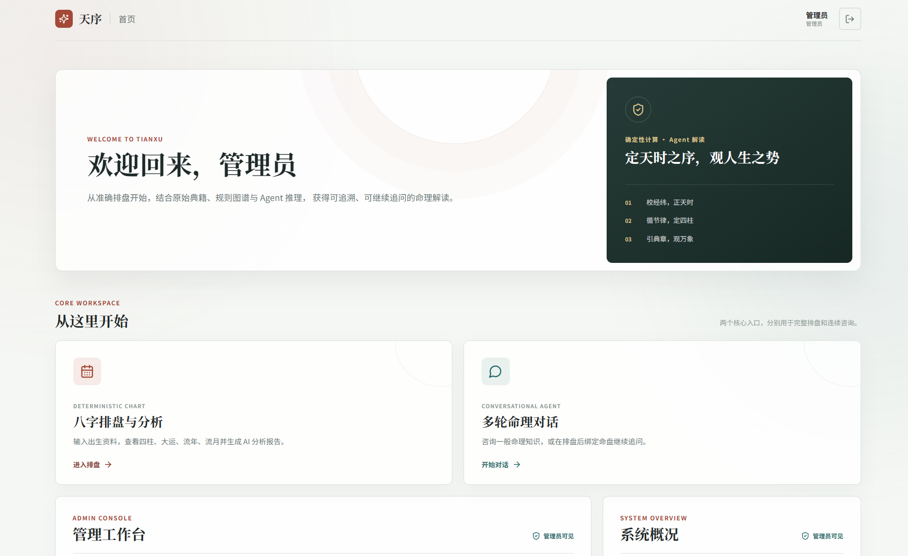
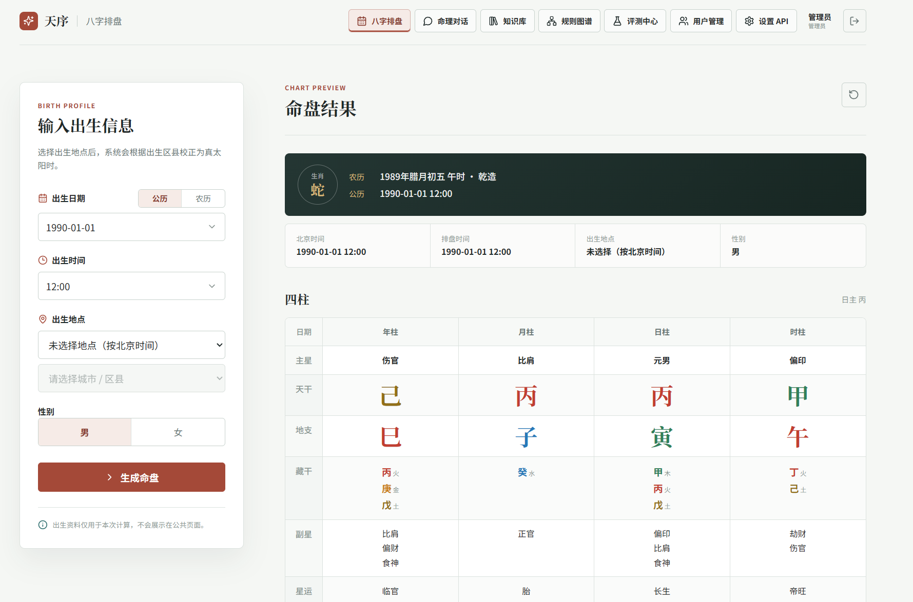
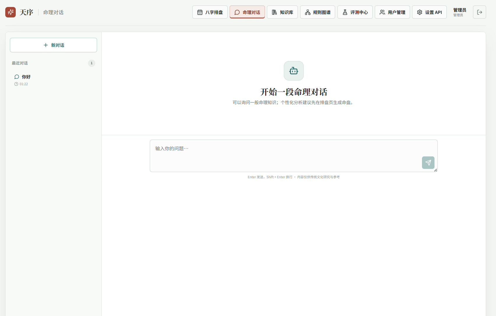
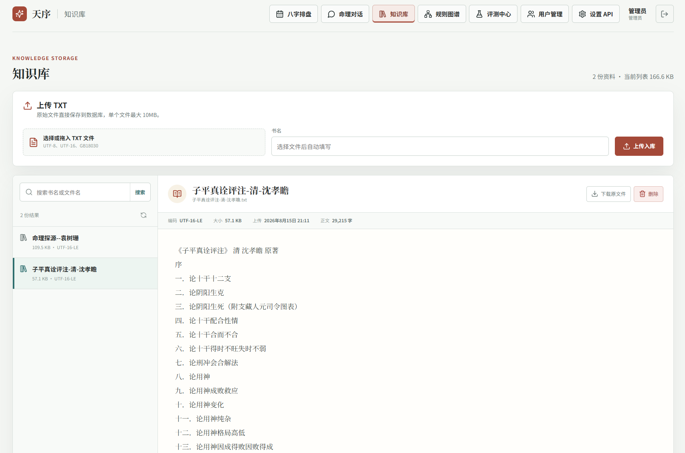
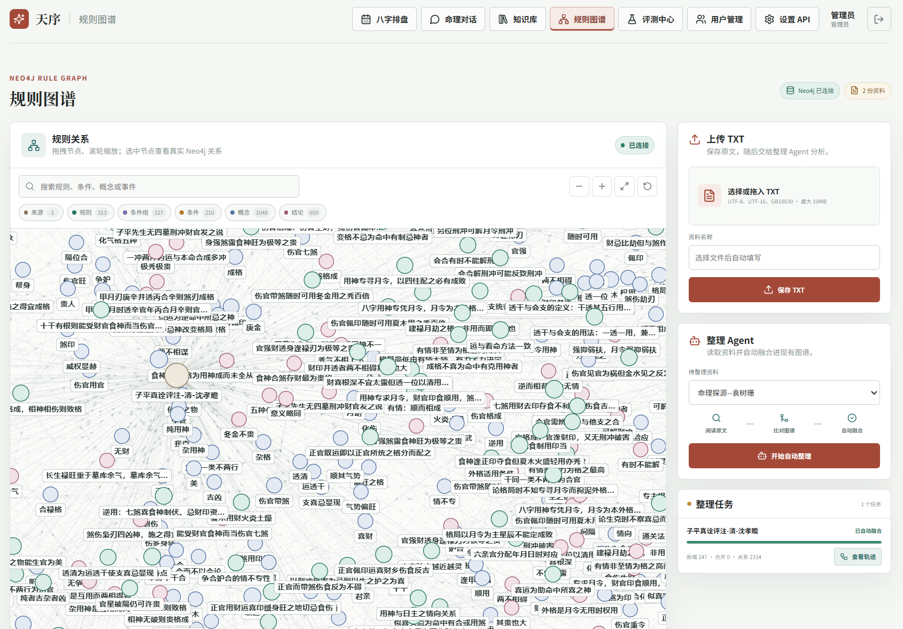
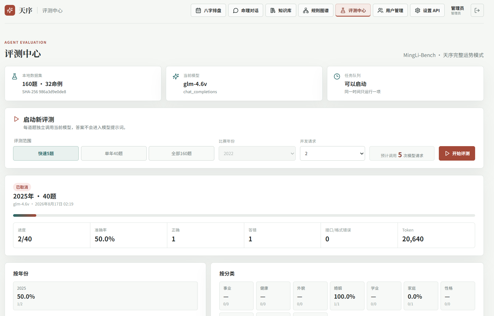
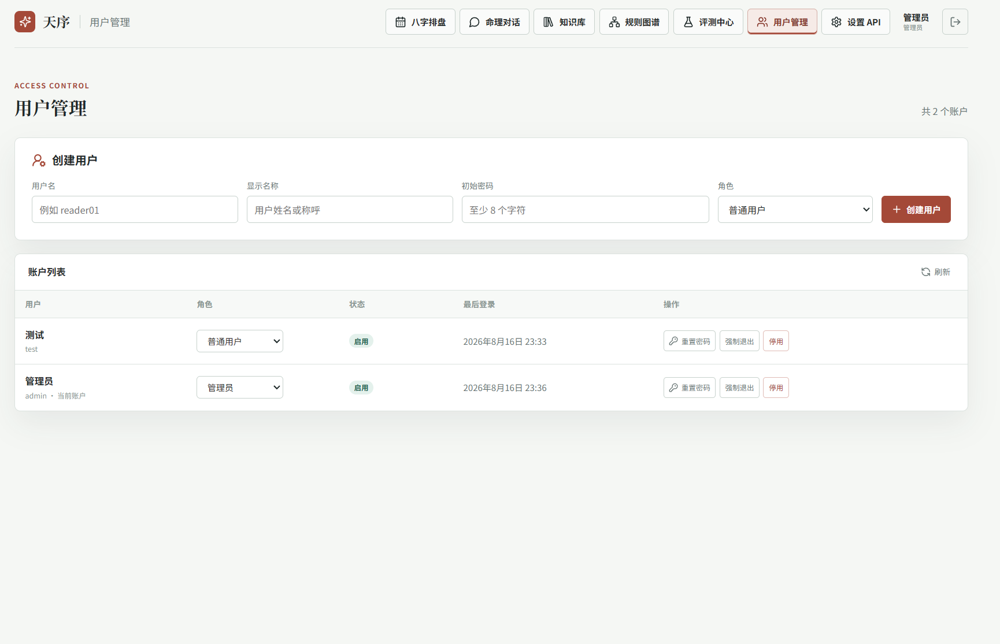
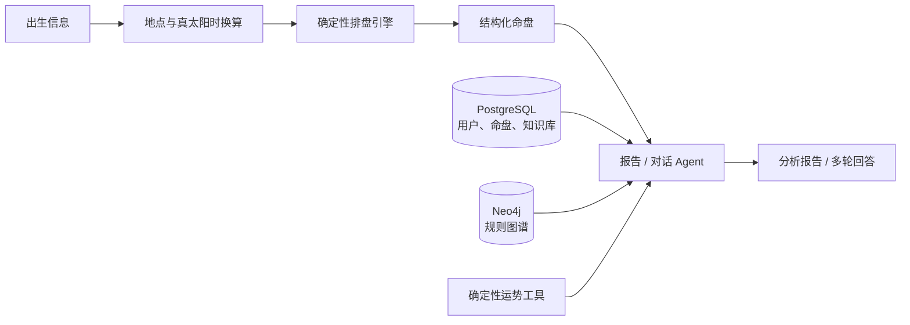

<div align="center">

# 天序 · Tianxu

**确定性八字排盘 × 知识检索 × 规则图谱 × AI Agent**

一个面向命理研究与应用验证的全栈分析平台：由后端引擎负责历法与命盘计算，<br>
由 Agent 基于结构化命盘、知识库原文和规则图谱完成可追溯的分析与对话。

[界面预览](#界面预览) · [核心能力](#核心能力) · [系统架构](#系统架构) · [快速开始](#快速开始) · [开发指南](#开发指南)

</div>

> [!IMPORTANT]
> 项目目前处于 MVP 阶段，适合本地部署、功能验证与二次开发。排盘结果及 AI 生成内容仅供研究和参考。

## 项目亮点

- **计算与解读分离**：历法转换、真太阳时、四柱及运势均由确定性引擎计算，模型不自行推算或修改命盘。
- **知识依据可追溯**：Agent 可检索知识库原文、查询 Neo4j 规则图谱，并在统一工具调用链路中组织回答。
- **完整业务闭环**：覆盖排盘、报告、多轮对话、资料管理、图谱整理、模型评测和用户权限管理。
- **本地优先部署**：通过 Docker Compose 启动前端、后端、PostgreSQL 与 Neo4j，模型密钥由服务端加密保存。

## 界面预览

### 工作台首页



### 核心体验

| 八字排盘与运势 | 多轮命理对话 |
| :---: | :---: |
|  |  |
| 公历 / 农历录入、真太阳时修正、四柱与运势展示 | 普通咨询或绑定已有命盘继续追问 |

### 管理工作台

| 知识库 | 规则图谱 |
| :---: | :---: |
|  |  |
| TXT 资料上传、检索、浏览与下载 | 规则关系可视化与图谱整理 Agent |

| 评测中心 | 用户与权限管理 |
| :---: | :---: |
|  |  |
| MingLi-Bench 分组评测、进度与结果统计 | 用户创建、角色调整、密码重置与会话撤销 |

## 核心能力

### 面向用户

- **确定性排盘**：支持公历、农历输入，展示四柱、藏干、十神、神煞、五行、大运、流年和流月。
- **真太阳时换算**：根据地点代表点经度和均时差，将北京时间换算为真太阳时后排盘。
- **AI 分析报告**：基于结构化命盘、知识库原文与规则图谱生成固定章节报告。
- **多轮命理对话**：既可进行通用咨询，也可绑定已生成的命盘继续追问。
- **账户与会话**：支持登录、修改密码和可撤销的 HttpOnly Session。

### 面向管理员

- **模型设置**：在管理界面保存并测试兼容 OpenAI 协议的模型配置。
- **知识库管理**：上传、搜索、分页浏览、下载和删除 TXT 原始资料。
- **规则图谱**：以 Neo4j 保存规则、条件、概念、结论与来源关系，并可视化真实连接。
- **图谱整理 Agent**：从知识库原文提取并融合规则，支持暂停、继续、重试、取消及执行轨迹查看。
- **模型评测**：运行 MingLi-Bench 快速 5 题、单年 40 题或完整 160 题评测。
- **访问控制**：创建用户、重置密码、调整角色、停用账户及撤销活跃会话。
- **执行链路**：查看报告、对话、评测和图谱整理过程中的 Agent 工具调用轨迹。

## 系统架构



排盘引擎与 Agent 保持明确边界：排盘引擎负责计算，Agent 只消费经过验证的数据并调用显式授权的工具。报告、对话、评测和图谱整理共用工具调用运行时，但各自拥有独立的工具白名单。

### 技术栈

| 层级 | 技术 |
| --- | --- |
| 前端 | Next.js 15、React 19、TypeScript、React Force Graph |
| 后端 | Python 3.12、FastAPI、SQLAlchemy、Alembic |
| 排盘 | lunar-python、项目内固定规则与测试 |
| Agent | OpenAI Responses / Chat Completions 兼容接口、能力包与工具调用 |
| 数据存储 | PostgreSQL 16、Neo4j 5 Community |
| 本地检索 | bge-base-zh-v1.5、ONNX Runtime、BM25、RRF |
| 部署 | Docker Compose |

## 快速开始

### 环境要求

- Docker Desktop（包含 Docker Compose）
- Git

后端镜像不会在构建时联网下载向量模型。首次启动前，请确认本地已有以下文件：

```text
external/models/bge-base-zh-v1.5/
├─ tokenizer.json
└─ onnx/model.onnx
```

模型来源为 `Xenova/bge-base-zh-v1.5`。模型目录仅保存在本机，并已被 `.gitignore` 排除。

### 1. 启动开发环境

```powershell
docker compose -f docker-compose.dev.yml up --build -d
```

本地开发配置已提供可直接使用的默认值，通常无需创建 `.env`。启动完成后可访问：

| 服务 | 地址 |
| --- | --- |
| Web 前端 | <http://localhost:3000> |
| FastAPI 文档 | <http://localhost:8000/docs> |
| 后端健康检查 | <http://localhost:8000/api/v1/health> |
| Neo4j Browser | <http://localhost:7474> |
| PostgreSQL | `localhost:5432` |
| Neo4j Bolt | `localhost:7687` |

### 2. 初始化管理员

首次打开前端会自动进入 `/setup`，用于创建首位管理员并直接登录。系统不提供默认管理员密码；初始化成功后，该入口会永久关闭。

如果前端暂时不可用，也可以通过命令行初始化：

```powershell
docker compose -f docker-compose.dev.yml exec backend uv run python -m app.cli create-admin --username admin --display-name 管理员
```

### 3. 配置 AI 模型

登录后，在页面右上角进入“设置 API”，填写 API 地址、模型名称与 API Key。API Key 不会注入前端环境变量，而是由后端加密保存至 PostgreSQL。

### 4. 查看状态与日志

```powershell
docker compose -f docker-compose.dev.yml ps
docker compose -f docker-compose.dev.yml logs -f frontend backend
```

停止开发环境：

```powershell
docker compose -f docker-compose.dev.yml down
```

启动不挂载源码、虚拟环境或 `node_modules` 的普通 Compose 环境：

```powershell
docker compose up --build -d
```

## 开发指南

### 环境变量

仅在需要修改端口、访问地址、图谱配置或开发主密钥时复制环境变量模板：

```powershell
Copy-Item .env.example .env
```

| 变量 | 用途 |
| --- | --- |
| `FRONTEND_PORT` | 前端映射端口 |
| `BACKEND_PORT` | 后端映射端口 |
| `NEXT_PUBLIC_API_BASE_URL` | 浏览器访问后端的地址 |
| `CORS_ORIGINS` | 允许携带 Session 的前端来源 |
| `APP_ENCRYPTION_KEY` | 加密模型 API Key 的 32 字节主密钥 |
| `NEO4J_*` | Neo4j 连接、凭据与端口设置 |
| `RULE_GRAPH_EMBEDDING_ENABLED` | 是否启用规则图谱向量召回 |
| `GRAPH_ORGANIZER_SECTION_TIMEOUT_SECONDS` | 图谱整理单章节与纠错循环的最大执行时间 |

修改 `FRONTEND_PORT` 时需同步调整 `CORS_ORIGINS`；修改 `BACKEND_PORT` 时需同步调整 `NEXT_PUBLIC_API_BASE_URL`。Compose 中的默认密码与主密钥仅适用于本地开发，不能用于生产环境。

### 不使用 Docker 启动

本地运行需要 Python 3.12+、[uv](https://docs.astral.sh/uv/)、Node.js 20+，以及可用的 PostgreSQL 和 Neo4j。请先参考 `.env.example` 提供数据库、图数据库、跨域与加密配置。

后端：

```powershell
cd backend
uv sync
uv run alembic upgrade head
uv run uvicorn app.main:app --reload --host 0.0.0.0 --port 8000
```

前端（另开终端）：

```powershell
cd frontend
npm ci
npm run dev
```

### 代码检查

```powershell
# 后端
cd backend
uv run ruff check app tests
uv run pytest

# 前端
cd ../frontend
npm run lint
npm run build
```

## 项目结构

```text
tianxu/
├─ frontend/                   Next.js 用户界面
├─ backend/                    FastAPI API、排盘引擎与 Agent 编排
│  ├─ app/                     后端业务代码
│  ├─ alembic/                 PostgreSQL 数据库迁移
│  └─ tests/                   后端测试
├─ docs/
│  └─ screenshots/             README 项目截图
├─ external/
│  ├─ MingLi-Bench/            固定评测数据子集
│  └─ models/                  本地向量模型（不提交至 Git）
├─ docker-compose.dev.yml      支持热更新的开发环境
├─ docker-compose.yml          普通 Compose 环境
└─ .env.example               环境变量模板
```

模块文档：

- [后端说明](backend/README.md)
- [前端说明](frontend/README.md)
- [出生地点与经纬度数据](backend/app/bazi/data/README.md)
- [MingLi-Bench 数据子集](external/MingLi-Bench/README.md)

## 排盘口径

- 出生时间统一按北京时间输入；选择地点后，后端根据地点经度与均时差换算真太阳时。
- 真太阳时计算公式：北京时间 + 4 ×（地点经度 − 120°）分钟 + 均时差。
- 当前提供中国大陆、香港、澳门和台湾共 3,243 个静态末级地点；缺少独立坐标时会明确拒绝排盘。
- 日柱采用 23:00 子初换日；年份按立春分界，月份按节气分界。
- 大运顺逆、起运、流年与流月由固定版本规则计算，响应会返回引擎及口径版本。
- 地点坐标为区县或地区代表点，不等同于医院或具体住址。临近换日、时辰或节气边界时，应使用更精确的地点复核。
- AI 报告不会覆盖排盘结果，知识库与图谱内容只作为解释依据。

数据来源、地区口径与许可证详见[地点数据说明](backend/app/bazi/data/README.md)。

## 数据与安全

- 密码使用 Argon2id 哈希，登录状态使用 HttpOnly Session Cookie。
- 模型 API Key 经 AES-GCM 加密后存入 PostgreSQL，浏览器仅能读取配置状态与末四位。
- 普通用户无法访问用户管理、知识库、评测和规则图谱等管理员接口。
- TXT 原文保存在 PostgreSQL；Neo4j 仅保存提取后的规则、条件、概念、结论与来源关系。
- 知识库按需检索和分页读取，不会将整本资料一次性放入模型上下文。
- 生产环境应使用独立强密钥、HTTPS、安全 Cookie 和严格的 `CORS_ORIGINS`。

> [!CAUTION]
> `docker compose -f docker-compose.dev.yml down -v` 会删除本地 PostgreSQL 与 Neo4j 数据卷。仅在确定需要清空全部开发数据时执行。
